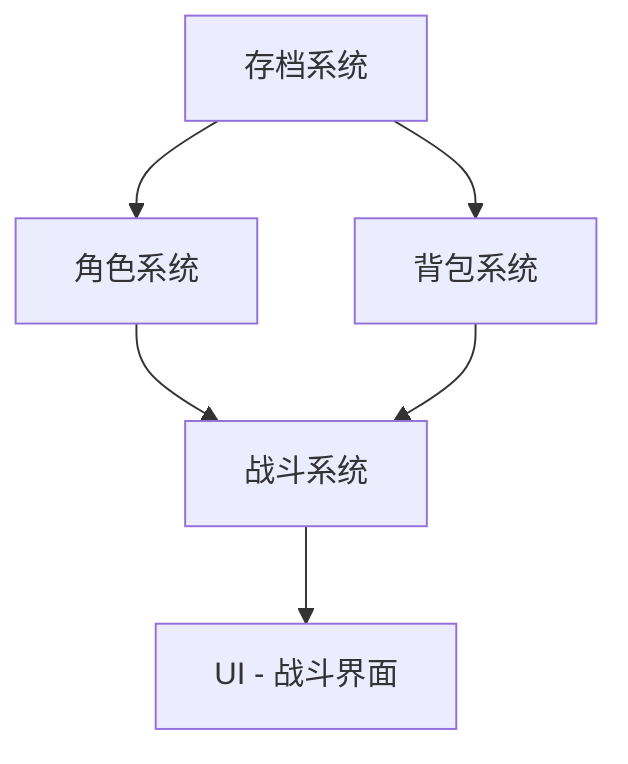

# /map-systems — 系统分解与依赖映射

> 角色：game-designer（游戏设计师） + technical-director（技术总监）
> 来源：改造自 Claude Code Game Studios 的 `/map-systems` Skill

## 前置条件
- `design/gdd/game-concept.md` 必须存在（运行 `/brainstorm` 创建）

## 工作流步骤

### 步骤 1：读取游戏概念

完整读取 `design/gdd/game-concept.md`，提取：
- 核心循环
- 游戏支柱
- 所有提到的系统/机制

### 步骤 2：识别系统

**显式系统**：概念文档中直接提到的系统
- 例：文档提到"战斗系统"、"背包系统" → 直接列入

**隐式系统**：被显式系统暗示但未明确列出的系统
- 例："战斗系统" 暗示 → "伤害计算"、"状态效果"、"命中判定"
- 例："角色成长" 暗示 → "经验值系统"、"属性系统"、"技能树"

### 步骤 3：系统分层

将所有系统按以下层级分类：

| 层级 | 说明 | 示例 |
|:-----|:-----|:-----|
| **Foundation（基础层）** | 被多个系统依赖的底层系统 | 存档系统、事件总线、资源管理 |
| **Core（核心层）** | 定义游戏身份的核心机制 | 战斗系统、移动系统、AI 系统 |
| **Feature（功能层）** | 扩展核心体验的功能系统 | 背包系统、任务系统、对话系统 |
| **Presentation（表现层）** | 用户感知层 | UI 系统、特效系统、音频系统 |
| **Polish（打磨层）** | 非必需但提升体验 | 屏幕震动、粒子效果、成就系统 |

### 步骤 4：绘制依赖图

为每个系统标注：
- **上游依赖**（这个系统依赖哪些系统？）
- **下游依赖**（哪些系统依赖这个系统？）

使用 Mermaid 图表展示依赖关系：


### 步骤 5：确定设计与构建顺序

基于依赖图推荐：
1. **设计顺序**：先设计没有上游依赖的系统
2. **构建顺序**：先实现 Foundation 层 → Core 层 → Feature 层
3. **并行机会**：标记哪些系统可以同时开发

### 步骤 6：输出系统索引

请求用户批准后，写入 `design/gdd/systems-index.md`：

```markdown
# 系统索引

## 基础层（Foundation）
### 存档系统
- 上游依赖：无
- 下游依赖：角色系统、背包系统、进度系统
- 设计优先级：🔴 高
- 设计状态：❌ 未设计

## 核心层（Core）
### 战斗系统
- 上游依赖：角色系统、背包系统
- 下游依赖：AI 系统、UI 战斗界面
- 设计优先级：🔴 高
- 设计状态：❌ 未设计

[... 所有系统 ...]
```

### 步骤 7：推荐下一步

```
🗺️ 系统映射完成！

📊 已识别系统：[N] 个
  - 基础层：[n] 个
  - 核心层：[n] 个
  - 功能层：[n] 个
  - 表现层：[n] 个
  - 打磨层：[n] 个

📁 系统索引：design/gdd/systems-index.md

推荐设计顺序：
  1. /design-system [第一个系统] — 设计最底层的基础系统
  2. /design-system [第二个系统] — 设计第二优先的系统
  ...
```
