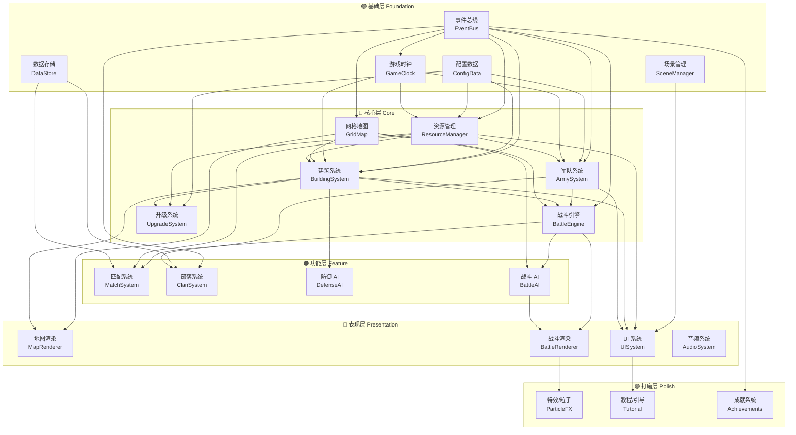

# 🗺️ 系统索引与依赖映射

> 由 `/map-systems` 工作流于 2026-03-23 生成
> 基于 `design/gdd/game-concept.md` 中定义的 7 大 MVP 系统

## 系统总览

| 层级 | 系统数 | 系统列表 |
|:-----|:-------|:---------|
| 🟣 基础层 Foundation | 5 | 事件总线、游戏时钟、数据存储、配置数据、场景管理 |
| 🔴 核心层 Core | 6 | 网格地图、资源管理、建筑系统、军队系统、战斗引擎、升级系统 |
| 🟠 功能层 Feature | 4 | 匹配系统、部落系统、防御 AI、战斗 AI（寻路+目标选择） |
| 🔵 表现层 Presentation | 4 | 地图渲染、战斗渲染、UI 系统、音频系统 |
| 🟢 打磨层 Polish | 3 | 特效/粒子、教程/引导、成就系统 |
| **合计** | **22** | |

---

## 依赖关系图

---

## 基础层（Foundation）

### 1. 事件总线 — EventBus
- **职责**：全局事件发布/订阅，解耦系统间通信
- **上游依赖**：无
- **下游依赖**：几乎所有系统
- **设计优先级**：🔴 最高
- **设计状态**：❌ 未设计
- **说明**：建筑完成、资源变化、战斗事件等都通过事件总线传播

### 2. 游戏时钟 — GameClock
- **职责**：管理游戏内时间（建造倒计时、资源产出周期、训练时间）
- **上游依赖**：事件总线
- **下游依赖**：建筑系统、资源管理、军队系统
- **设计优先级**：🔴 最高
- **设计状态**：❌ 未设计
- **说明**：COC 的核心特征 — 一切都需要等待时间，时钟驱动整个经济循环

### 3. 数据存储 — DataStore
- **职责**：玩家数据的持久化（本地 IndexedDB，后续可同步到服务端）
- **上游依赖**：无
- **下游依赖**：匹配系统、部落系统
- **设计优先级**：🔴 最高
- **设计状态**：❌ 未设计
- **说明**：MVP 先用 IndexedDB 本地存储，后续扩展到云端

### 4. 配置数据 — ConfigData
- **职责**：游戏数值配置（建筑属性表、兵种属性表、升级费用/时间表）
- **上游依赖**：无
- **下游依赖**：建筑系统、军队系统、升级系统、资源管理
- **设计优先级**：🔴 最高
- **设计状态**：❌ 未设计
- **说明**：所有数值来自 JSON 配置文件，方便调平衡

### 5. 场景管理 — SceneManager
- **职责**：管理不同的游戏场景（主村庄、战斗、部落界面等）
- **上游依赖**：无
- **下游依赖**：UI 系统
- **设计优先级**：🟠 中
- **设计状态**：❌ 未设计

---

## 核心层（Core）

### 6. 网格地图 — GridMap
- **职责**：管理基地的二维网格（如 40×40），处理坐标系、可通行性、建筑占位
- **上游依赖**：事件总线
- **下游依赖**：建筑系统、战斗引擎、战斗 AI、地图渲染
- **设计优先级**：🔴 最高
- **设计状态**：❌ 未设计
- **说明**：COC 使用正方形网格，建筑占据 NxN 格（如大本营 4x4，围墙 1x1）

### 7. 资源管理 — ResourceManager
- **职责**：管理三种资源（金币、圣水、宝石）的生产、存储、消耗和上限
- **上游依赖**：事件总线、游戏时钟、配置数据
- **下游依赖**：建筑系统、军队系统、升级系统、匹配系统、UI 系统
- **设计优先级**：🔴 最高
- **设计状态**：❌ 未设计
- **说明**：资源四循环 — 生产→存储→消耗→掠夺。存储有上限（由存储建筑等级决定）

### 8. 建筑系统 — BuildingSystem
- **职责**：建筑的放置、移动、建造队列、状态管理
- **上游依赖**：网格地图、资源管理、游戏时钟、配置数据、事件总线
- **下游依赖**：升级系统、战斗引擎、防御 AI、地图渲染、UI 系统
- **设计优先级**：🔴 最高
- **设计状态**：❌ 未设计
- **说明**：建筑类型包括：资源产出（金矿、圣水收集器）、资源存储（金库、圣水瓶）、军事（兵营、训练营、实验室）、防御（加农炮、箭塔、城墙）、核心（大本营）

### 9. 军队系统 — ArmySystem
- **职责**：兵种训练、军队编成、容量管理、兵种属性
- **上游依赖**：资源管理、游戏时钟、配置数据、事件总线
- **下游依赖**：战斗引擎、部落系统（捐兵）、UI 系统
- **设计优先级**：🔴 最高
- **设计状态**：❌ 未设计
- **说明**：MVP 兵种 — 野蛮人、弓箭手、巨人、哥布林、炸弹人

### 10. 战斗引擎 — BattleEngine
- **职责**：战斗流程管理（部署阶段→战斗阶段→结算阶段）、胜负判定、星级评价、资源掠夺计算
- **上游依赖**：军队系统、建筑系统、网格地图
- **下游依赖**：战斗 AI、匹配系统、战斗渲染
- **设计优先级**：🔴 最高
- **设计状态**：❌ 未设计
- **说明**：战斗是异步的 — 进攻方放兵后由 AI 自动执行，180 秒时限。评星标准：摧毁 50% 建筑=1 星，大本营被摧毁=1 星，全部摧毁=3 星

### 11. 升级系统 — UpgradeSystem
- **职责**：管理建筑升级、兵种升级、大本营升级的前置条件和效果
- **上游依赖**：建筑系统、资源管理、配置数据
- **下游依赖**：无（效果通过事件传播到其他系统）
- **设计优先级**：🟠 中
- **设计状态**：❌ 未设计
- **说明**：大本营等级决定可建造的建筑类型和数量上限

---

## 功能层（Feature）

### 12. 匹配系统 — MatchSystem
- **职责**：搜索对手基地、奖杯计算、排名机制
- **上游依赖**：战斗引擎、资源管理、数据存储
- **下游依赖**：无
- **设计优先级**：🟠 中
- **设计状态**：❌ 未设计
- **说明**：MVP 阶段先生成 AI 基地作为对手，后续接入真实玩家数据

### 13. 部落系统 — ClanSystem
- **职责**：部落创建/加入/退出、成员管理、捐兵、部落聊天
- **上游依赖**：事件总线、数据存储、军队系统
- **下游依赖**：无（后续部落战扩展）
- **设计优先级**：🟠 中
- **设计状态**：❌ 未设计
- **说明**：需要后端支持。MVP 可做简化版（本地模拟或仅 UI 框架）

### 14. 防御 AI — DefenseAI
- **职责**：防御建筑的目标选择和攻击逻辑
- **上游依赖**：建筑系统
- **下游依赖**：无（被战斗引擎调用）
- **设计优先级**：🟠 中
- **设计状态**：❌ 未设计
- **说明**：防御塔自动瞄准范围内最近/最优先的目标

### 15. 战斗 AI — BattleAI
- **职责**：进攻单位的 A* 寻路、目标选择、行为状态机
- **上游依赖**：战斗引擎、网格地图
- **下游依赖**：战斗渲染
- **设计优先级**：🔴 最高 ⚠️ 核心难点
- **设计状态**：❌ 未设计
- **说明**：不同兵种有不同的目标偏好（巨人→防御建筑，哥布林→资源建筑）。围墙被摧毁后需重新计算路径

---

## 表现层（Presentation）

### 16. 地图渲染 — MapRenderer
- **职责**：渲染基地网格、建筑精灵、地形纹理、相机控制（平移/缩放）
- **上游依赖**：网格地图、建筑系统
- **下游依赖**：无
- **设计优先级**：🟠 中
- **设计状态**：❌ 未设计
- **说明**：基于 PixiJS Container 的图层管理（地面层→建筑层→UI 层）

### 17. 战斗渲染 — BattleRenderer
- **职责**：渲染战斗场景（单位动画、弹道、爆炸、伤害数字）
- **上游依赖**：战斗引擎、战斗 AI
- **下游依赖**：特效/粒子
- **设计优先级**：🟠 中
- **设计状态**：❌ 未设计

### 18. UI 系统 — UISystem
- **职责**：游戏 HUD、弹窗、菜单、建造面板、战斗部署栏
- **上游依赖**：场景管理、资源管理、建筑系统、军队系统
- **下游依赖**：教程/引导
- **设计优先级**：🟠 中
- **设计状态**：❌ 未设计
- **说明**：PixiJS 渲染 HUD + HTML/CSS 复杂弹窗

### 19. 音频系统 — AudioSystem
- **职责**：BGM、音效播放和管理
- **上游依赖**：无
- **下游依赖**：无
- **设计优先级**：🟢 低
- **设计状态**：❌ 未设计
- **说明**：打磨阶段再做

---

## 打磨层（Polish）

### 20. 特效/粒子 — ParticleFX
- **职责**：爆炸、烟雾、升级光效等视觉特效
- **上游依赖**：战斗渲染
- **设计优先级**：🟢 低
- **设计状态**：❌ 未设计

### 21. 教程/引导 — Tutorial
- **职责**：新手引导流程
- **上游依赖**：UI 系统
- **设计优先级**：🟢 低
- **设计状态**：❌ 未设计

### 22. 成就系统 — Achievements
- **职责**：里程碑成就和奖励
- **上游依赖**：事件总线
- **设计优先级**：🟢 低
- **设计状态**：❌ 未设计

---

## 推荐构建顺序

### 第 1 波：基础设施（无依赖，可并行）
1. 事件总线 EventBus
2. 配置数据 ConfigData
3. 数据存储 DataStore
4. 游戏时钟 GameClock

### 第 2 波：核心地基
5. 网格地图 GridMap
6. 资源管理 ResourceManager

### 第 3 波：核心系统
7. 建筑系统 BuildingSystem
8. 军队系统 ArmySystem

### 第 4 波：核心玩法
9. 升级系统 UpgradeSystem
10. 战斗 AI BattleAI + 防御 AI DefenseAI
11. 战斗引擎 BattleEngine

### 第 5 波：功能扩展
12. 匹配系统 MatchSystem
13. 部落系统 ClanSystem

### 第 6 波：表现层
14. 地图渲染 MapRenderer（与第 2-3 波并行开发）
15. 战斗渲染 BattleRenderer（与第 4 波并行开发）
16. UI 系统 UISystem
17. 场景管理 SceneManager

### 第 7 波：打磨层
18. 音频 AudioSystem
19. 特效 ParticleFX
20. 教程 Tutorial
21. 成就 Achievements

> ⚠️ **注意**：表现层（渲染、UI）应尽早与核心系统并行开发，以便及时验证玩法体验。建议从第 2 波开始就同步做简单的地图渲染。
