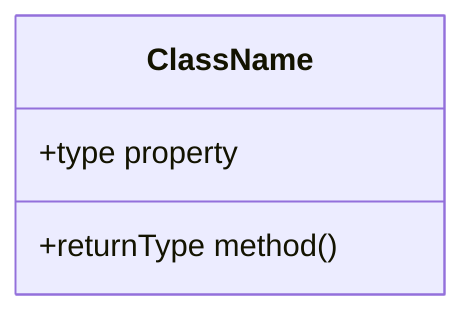
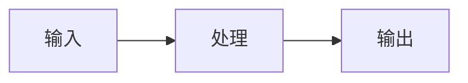

# 🔧 技术设计文档模板

## 文档信息
- **系统名称**：[填写]
- **对应 GDD**：`design/gdd/[系统名].md`
- **版本**：v1.0
- **作者**：[填写]
- **状态**：[草稿 / 审查中 / 已批准]

## 1. 概述
[基于 GDD 的技术实现方案概述]

## 2. 架构设计

### 2.1 类图


### 2.2 数据流


### 2.3 关键接口
```
interface ISystemName:
    func initialize() -> void
    func update(delta: float) -> void
    func cleanup() -> void
```

## 3. 数据结构

| 结构名 | 用途 | 字段 |
|:-------|:-----|:-----|
| [名称] | [用途] | [字段列表] |

## 4. 算法说明
[关键算法的伪代码和复杂度分析]

## 5. 性能考虑
- 预期对象数量：[N]
- 每帧计算量：[估算]
- 内存占用：[估算]
- 优化策略：[描述]

## 6. 错误处理
| 错误场景 | 处理方式 | 恢复策略 |
|:---------|:---------|:---------|
| [场景] | [处理] | [恢复] |

## 7. 测试策略
- 单元测试重点：[列表]
- 集成测试重点：[列表]
- 性能基准：[指标]

## 8. 实现计划
| 步骤 | 预计时间 | 依赖 |
|:-----|:---------|:-----|
| [步骤 1] | [时间] | [依赖] |
